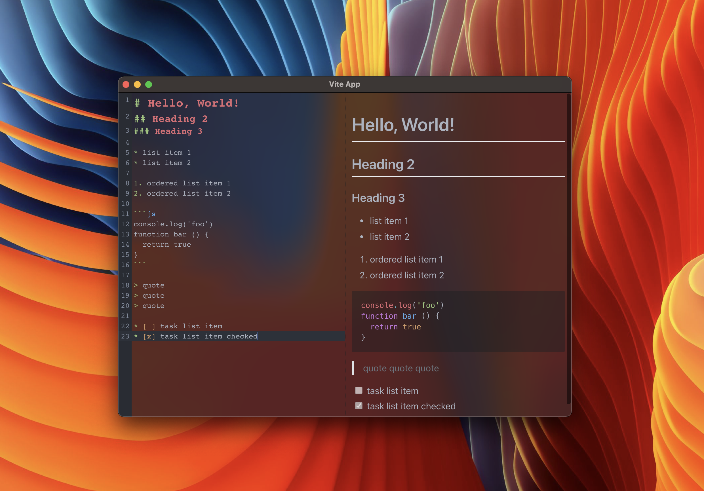

# Markdown Editor Tutorial



A tutorial for building a beautiful Markdown editor

## Sponsor

[](https://www.inkdrop.app/)  
A cross-platform Markdown note-taking app

## Stack

- [Electron](https://www.electronjs.org/) - A framework for building cross-platform desktop apps using HTML, JS, and CSS
- [Vite](https://vitejs.dev/) - A fast build tool
- React - A library for building UI
- TypeScript - A typed JavaScript
- [CodeMirror 6](https://codemirror.net/6/) - An extensible code editor for the web
- [Remark](https://remark.js.org/) - An extensible Markdown processor

## Get started

```sh
npm i
npm run watch
```

## Project Structure

The structure of this project is very similar to the structure of a monorepo.

The entire source code of the program is divided into three modules (packages) that are bundled each independently:
- [`packages/main`](packages/main)
Electron [**main script**](https://www.electronjs.org/docs/tutorial/quick-start#create-the-main-script-file).
- [`packages/preload`](packages/preload)
Used in `BrowserWindow.webPreferences.preload`. See [Checklist: Security Recommendations](https://www.electronjs.org/docs/tutorial/security#2-do-not-enable-nodejs-integration-for-remote-content).
- [`packages/renderer`](packages/renderer)
Electron [**web page**](https://www.electronjs.org/docs/tutorial/quick-start#create-a-web-page).

### Build web resources

Packages `main` and `preload` are built in [library mode](https://vitejs.dev/guide/build.html#library-mode) as it is a simple javascript.
`renderer` package build as regular web app.

The build of web resources is performed in the [`scripts/build.js`](scripts/build.js). Its analogue is a sequential call to `vite build` for each package.

### Compile App
Next step is run  packaging and compilation a ready for distribution Electron app for macOS, Windows and Linux with "auto update" support out of the box. 

To do this, using the [electron-builder]:
- In npm script `compile`: This script is configured to compile the application as quickly as possible. It is not ready for distribution, is compiled only for the current platform and is used for debugging.
- In GitHub Action: The application is compiled for any platform and ready-to-distribute files are automatically added to the draft GitHub release. 


### Using Node.js API in renderer
According to [Electron's security guidelines](https://www.electronjs.org/docs/tutorial/security#2-do-not-enable-nodejs-integration-for-remote-content), Node.js integration is disabled for remote content. This means that **you cannot call any Node.js api in the `packages/renderer` directly**. To do this, you **must** describe the interface in the `packages/preload` where Node.js api is allowed:
```ts
// packages/preload/src/index.ts
import {readFile} from 'fs/promises'

const api = {
  readConfig: () =>  readFile('/path/to/config.json', {encoding: 'utf-8'}),
}

contextBridge.exposeInMainWorld('electron', api)
```

```ts
// packages/renderer/src/App.vue
import {useElectron} from '/@/use/electron'

const {readConfig} = useElectron()
```

[Read more about Security Considerations](https://www.electronjs.org/docs/tutorial/context-isolation#security-considerations).

**Note**: Context isolation disabled for `test` environment. See [#693](https://github.com/electron-userland/spectron/issues/693#issuecomment-747872160).


### Modes and Environment Variables
All environment variables set as part of the `import.meta`, so you can access them as follows: `import.meta.env`. 

You can also build type definitions of your variables by running `scripts/buildEnvTypes.js`. This command will create `types/env.d.ts` file with describing all environment variables for all modes.

The mode option is used to specify the value of `import.meta.env.MODE` and the corresponding environment variables files that needs to be loaded.

By default, there are two modes:
  - `production` is used by default
  - `development` is used by `npm run watch` script
  - `test` is used by `npm test` script

When running building, environment variables are loaded from the following files in your project root:

```
.env                # loaded in all cases
.env.local          # loaded in all cases, ignored by git
.env.[mode]         # only loaded in specified env mode
.env.[mode].local   # only loaded in specified env mode, ignored by git
```

**Note:** only variables prefixed with `VITE_` are exposed to your code (e.g. `VITE_SOME_KEY=123`) and `SOME_KEY=123` will not.  you can access `VITE_SOME_KEY` using `import.meta.env.VITE_SOME_KEY`. This is because the `.env` files may be used by some users for server-side or build scripts and may contain sensitive information that should not be exposed in code shipped to browsers.

## Author

Takuya Matsuyama ([@craftzdog](https://github.com/craftzdog))


[vite]: https://github.com/vitejs/vite/
[electron]: https://github.com/electron/electron
[electron-builder]: https://github.com/electron-userland/electron-builder
[vue]: https://github.com/vuejs/vue-next
[vue-router]: https://github.com/vuejs/vue-router-next/
[typescript]: https://github.com/microsoft/TypeScript/
[spectron]: https://github.com/electron-userland/spectron
[vue-tsc]: https://github.com/johnsoncodehk/vue-tsc
[eslint-plugin-vue]: https://github.com/vuejs/eslint-plugin-vue
[cawa-93-github]: https://github.com/cawa-93/
[cawa-93-sponsor]: https://www.patreon.com/Kozack/
